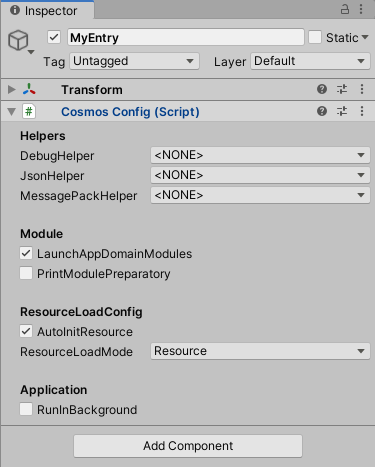

[](LICENSE)
[](https://github.com/DonnYep/CosmosFramework/issues)

# [English](README_EN.md) 

# CosmosFramework

CosmosFramework是一款中轻量级的Unity开发框架。框架拥有丰富的Unity方法扩展以及工具链。async/await语法支持，多网络通道支持，完整的打包流水线。支持自动化部署。框架遵循unityPackage规范，建议通过UPM导入使用。
* [CosmosFramework Wiki](https://github.com/DonnYep/CosmosFramework/wiki)<br/>

<a name="导航"></a>

# 导航
- [English](#english)
- [CosmosFramework](#cosmosframework)
- [导航](#导航)
  - [环境](#环境)
  - [启动框架](#启动框架)
  - [模块简介](#模块简介)
  - [内置数据结构、工具](#内置数据结构工具)
  - [内置架构 PureMVC](#内置架构-puremvc)
  - [注意事项](#注意事项)
  - [UPM](#upm)
  - [其他](#其他)
  - [Library link](#library-link)

- [ResourceEditor文档](Docs/RESOURCE_EDITOR.md)

<a name="环境"></a>

## 环境

- Unity版本:2018及以上,DOTNET API版本:4.x。

<a name="启动框架"></a>

## 启动框架


- 在游戏入口处添加CosmosConfig组件，添加后即可启动框架。

<a name="模块简介"></a>

## 模块简介

- **Audio**: 游戏音效模块。通过注册音效信息，播放时传入音效名即可自动加载音效资源播放。音效支持分组，且可整组播放。

- **Config**:游戏常用配置模块。用户可在游戏初始化时读取配置文件，并缓存于配置模块。运行时在其他所需位置读取对应配置的数据。

- **Controller**:控制器模块。使用此模块进行注册后，无需生成实体对象(GameObject)也可进行轮询管理。此模块提供Update轮询。

- **DataNode**:数据缓存模块。数据以树形结构存储于此模块中，可通过web地址格式或者逗号分隔符获取对应数据的对象。

- **DataTable**:数据表模块。在此模块中，数据行以对象形式存储于数据表中。数据表可实时增删改查，并通过自定义的反序列化方式生成所需要的数据对象。

- **Download**:下载模块。支持localhost本地文件下载与http文件下载。文件下载时以byte流异步增量写入本地。下载中支持动态添加、移除下载任务；

- **Entity**:游戏实体模块。管理游戏运行时的实体对象。实体支持组分类，通过传入资源地址可以直接管理资源实体对象的生成、回收等操作，内置对象池生成。

- **Event**:事件中心模块。使用标准事件模型，提供了监听、移除、派发等常用事件功能。提供事件观测方法，可实时检测事件状态。

- **FSM**:有限状态机模块。完全抽象的有限状态机，可针对不同类型的拥有者做状态机实现。

- **Input**:输入适配模块。通过虚拟按键模拟各个平台的输入，传入不同的输入适配器可适配不同平台的输入方式。

- **Main**:模块中心。自定义模块与扩展模块都存于此。自定义模块按照内置模块相同格式写入后，可享有完全同等与内置模块的生命周期与权限。几乎与内置模块无异。此主模块的内置轮询池:FixedRefreshHandler、LateRefreshHandler、RefreshHandler、ElapseRefreshHandler可对需要统一进行轮询管理的对象进行统一轮询，减少由于过多的Update等mono回调导致的性能损耗。

- **Network**:网络模块。提供了多种高速可靠的UDP协议，如RUDP、SUDP、KCP、TCP等，默认使用KCP协议。网络以通道(Channel)形式区分各个连接，支持多种网络类型同时连接。可实现(Client-Server)模式。支持async/await语法。

- **ObjectsPool**:对象池模块。提供常用的实体对象生成回收等功能。底层使用数据结构Pool进行实现。

- **Procedure**:流程节点模块。方便管理运行时执行的逻辑节点，如热游戏启动节点，资源校验节点，下载资源节点，进入游戏节点等。将每个操作封装为节点，则大大有利于项目维护。

- **Resource**:资源加载模块。内置提供AssetDatabase、AssetBundle以及Resource三种加载模式。AssetDatabase与AssetBundle模式支持引用计数，资源包会根据引用计数自动管理包体的加载或卸载。Runtime加载器可自定义加载方案。支持自动化流水线，如Jenkins构建部署等。资源模块对应的编辑器位于Window>Cosmos>Module>Resource。开发阶段阶段使用AssetDatabase模式，构建app时使用AssetBundle模式。若需要使用Unity Resource作为加载方案，则切换为Resource模式。

- **Scene**:场景加载模块。提供常用的异步、同步加载嵌入的场景功能。支持自定义实现加载方式。

- **UI**:UI模块。抽象实现UI面板以及UI的加载方式。支持激活，失活，面板优先级，组别设置等功能，使用更轻便。框架提供了基于UGUI实现的面板类与资源加载帮助体。其他UI方案可自行扩展，目前稳定兼容FGUI。

- **WebRequest**:UnityWebRequest模块，可用于加载持久化资源、网络资源下载等需求。支持获取AssetBundle、AudioClip、Texture2D、string。当资源获取到后，用户可通过WebRequestCallback对资源进行操作。


<a name="内置数据结构、工具"></a>

## 内置数据结构、工具

- **Utility**:提供了反射、算法、断言、转换、Debug富文本、IO、加密、Json、MessagePack、Time、Text、Unity协程、Unity组件等常用工具函数。

- **Singleton**:单例基类。提供了线程安全、非线程安全、MONO单例基类。

- **DataStructure**:常用数据结构。链表、双向链表、双向字典、二叉树、四叉树、AStar、LRU、线程锁等数据结构。

- **Extensions**:静态扩展库。提供Unit以及C#原生的相关扩展方法。

- **Awaitable** :此工具提供了async/await语法在unity环境中的支持。可以像写c#原生异步一样,在Unity中写异步。支持Task异步，Task执行完成后会回到主线程，使用时按照正常格式写即可。

- **EventCore** 完全抽象的事件数据结构。内含普通、标准与线程安全类型。
```CSharp
    //声明一个类，使其派生自EventCore，并做类型约束。
    public class MyEventCore :EventCore<string,string, MyEventCore>{}
    //实现后即可使用自定义的事件监听。
```
- **ReferencePool** :全局引用池模块。

- **Editor** :Editor中提供了在Hierarchy常用检索对象、组件的方法，EditorConfig提供了代码生成是自动创建代码标头的功能；

- **FutureTask**:异步任务检测，支持多线程与协程异步进度检测。检测函数需要传入Func<bool>格式的函数，当条件返回值为true时，异步检测结束。支持async/await语法，可使用await语句等待任务完成。

- **Pool**:池数据结构。包含线程安全与非线程安全类型。框架中的对象池、引用池以及其他模块的缓存池都使用了“Pool”进行实现。
    
<a name="内置架构-PureMVC"></a>

## 内置架构 PureMVC

- 基于原始PureMVC改进的更适于理解的架构。
    框架提供了基于特性更加简洁的注册方式:
    - 1.MVCCommandAttribute，对应Command，即C层；
    - 2.MVCMediatorAttribute，对应Mediator，即V层；
    - 3.MVCProxyAttribute，对应Proxy，即M层；
    
- MVC自动注册只需在入口调用MVC.RegisterAttributedMVC()方法即可。

- 派生的代理类需要覆写构造函数，并传入NAME参数。

- 需要注意，MVC.RegisterAttributedMVC()方法需要传入对应的程序集。支持多程序集反射。

<a name="注意事项"></a>

## 注意事项

- 内置案例地址:Assets\Examples\ 。

<a name="UPM"></a>

## UPM

- CosmosFramework遵循unityPackage规范，可以完全将整个库放置于Packages目录下。

- 从本地导入：选择Assets/CosmosFramework文件夹，拷贝到工程的Packages目录下。

- 从git导入：填入url: https://github.com/DonnYep/CosmosFramework.git#v1.3_upm

<a name="其他"></a>

## 其他

- 部分模块演示请观看视频:
    - https://www.bilibili.com/video/BV11P4y1U7vB
    - https://www.bilibili.com/video/BV1x741157eR
    - https://www.bilibili.com/video/BV17u411Z7Ni
    
<a name="Library-link"></a>

## Library link

- HybridCLR:https://github.com/focus-creative-games/hybridclr

- CosmosEngine:https://github.com/DonnYep/CosmosEngine

- QuarkAsset:https://github.com/DonnYep/QuarkAsset

- KCP C:https://github.com/skywind3000/kcp
    
- KCP CSharp:https://github.com/vis2k/kcp2k
    
- TCP:https://github.com/vis2k/Telepathy

- Mirror:https://github.com/vis2k/Mirror

**[回到最上层](#导航)**
